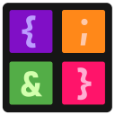
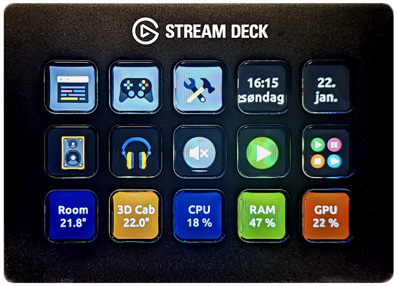

 

# Code Deck

- [Code Deck](#code-deck)
  - [Description](#description)
  - [Concept](#concept)
    - [Configuration](#configuration)
    - [Graphical User Interface](#graphical-user-interface)
    - [Key](#key)
    - [Page](#page)
    - [Profile](#profile)
    - [Tile](#tile)
    - [Plugin](#plugin)
  - [Plugins](#plugins)
    - [List Of Built In Plugins \& Tiles](#list-of-built-in-plugins--tiles)
    - [Plugin Development](#plugin-development)
  - [Supported Stream Decks](#supported-stream-decks)
    - [Tested Stream Decks](#tested-stream-decks)
  - [Attributions](#attributions)
  - [Disclaimer](#disclaimer)

## Description

**Code Deck** is an open source alternative to the official Stream Deck application.

The `Code`-part of the name is a reference to how configuration and plugins work in **Code Deck**. The configuration is done using `JSON` and all plugins are `C#`-scripts.

*Picture of **Code Deck** running my configuration on my Stream Deck.*

## Concept

**Code Deck** was made with *control* and *extensibility* as the primary goals. **Code Deck** strives to be light-weight, but that heavily depends on the users plugins and configuration.

### Configuration
**Code Deck** is configured using a single `JSON`-file. The configuration file must be located in the same directory as the **Code Deck** executable. If no configuration file exists, a default configuration will be created on startup. Changes to the configuration are automatically applied.

The configuration file is called `deck.json`.

### Graphical User Interface
**Code Deck** *DOES NOT* have a graphical user interface for configuration.

Windows users may use `CodeDeck.Windows.exe` which adds an icon to the notification area on the taskbar. The icon has a context menu with easy access to the configuration file and a way to easily exit **Code Deck**.

### Key
- A single key on the Stream Deck.
- There are multiple key types:
  - `Normal`
    - Normal key that can be customized with the available settings.
      - May optionally be associated with a plugin and a tile.
  - `Page`
    - Navigates to the specified page.
  - `Back`
    - Navigates to the previous page.

### Page
- A page is a logical representation of a group of keys.
- A page can contain one or more keys.

### Profile
- A profile is a logical representation of a group of pages.
- There are multiple profile types:
  - `Normal`
  - `LockScreen`
    - **Code Deck** switches to this profile when the computer is locked.
      - Currently only supported on Windows 🪟.

### Tile
- A tile implements a piece of functionality.
- A tile can modify all properties of a key.
- A tile can react to key presses.

### Plugin
- A plugin can contain one or more tiles.
- Plugins are written in `C#`.
- Plugins are compiled on the fly when **Code Deck** starts.
- All plugins can be modified by the user.

## Plugins

**Code Deck** has a powerful, but easy to use plugin system.

Plugins are located in the `Plugins`-directory. All plugins are coded in `C#` and gets compiled on startup using `Roslyn`. All the *"built in"* plugins work in the same way and their `C#`-scripts are available in the same `Plugins`-directory.

### List Of Built In Plugins & Tiles

| Name                | Tile                    | OS Support | Description |
|---------------------|-------------------------|------------|-------------|
| AudioDeviceSwitcher | AudioDeviceSwitcherTile | 🪟        |             |
| Clock               | DigitalClockTile        | 🪟🐧      |             |
| Counter             | CounterTile             | 🪟🐧      |             |
| Lock                | LockTile                | 🪟        |             |
| MediaKeys           | MuteTile                | 🪟        |             |
|                     | VolumeDownTile          | 🪟        |             |
|                     | VolumeUpTile            | 🪟        |             |
|                     | NextTrackTile           | 🪟        |             |
|                     | PreviousTrackTile       | 🪟        |             |
|                     | StopTile                | 🪟        |             |
|                     | PlayPauseTile           | 🪟        |             |
| PerformanceCounters | CpuUsageTile            | 🪟        |             |
|                     | MemoryUsageTile         | 🪟        |             |
|                     | GpuUsageTile            | 🪟        |             |
| Runner              | RunTile                 | 🪟🐧      |             |
|                     | OpenWebsiteTile         | 🪟🐧      |             |
| Template            | TemplateTileOne         | 🪟🐧      |             |
|                     | TemplateTileTwo         | 🪟🐧      |             |
| KeyboardSimulator   | TyperTile               | 🪟        |             |
|                     | HotkeyTile              | 🪟        |             |
| WebRequest          | PlainTextTile           | 🪟🐧      |             |

### Plugin Development
Read about plugin development [here!](CodeDeck.Plugins/Plugins/)

## Supported Stream Decks

**Code Deck** *should* work with any Stream Deck hardware supported by [`OpenMacroBoard` & `StreamDeckSharp`](https://github.com/OpenMacroBoard/StreamDeckSharp).

### Tested Stream Decks

| Stream Deck Hardware          | Status     | Notes                                    |
|-------------------------------|------------|------------------------------------------|
| Stream Deck Mini              | Untested   |                                          |
| Stream Deck (Standard) (MK.1) | ✔️         |                                          |
| Stream Deck (Standard) (MK.2) | Untested   |                                          |
| Stream Deck +                 | Untested   | Stream Deck + has an additional screen (or screen area at least) and rotary knobs. The "standard" buttons might work. |
| Stream Deck XL                | Untested   |                                          |

## Attributions

**Code Deck** makes heavy use of the following great libraries:
- [StreamDeckSharp](https://github.com/OpenMacroBoard/StreamDeckSharp)
- [ImageSharp](https://github.com/SixLabors/ImageSharp)

## Disclaimer
**Code Deck** is not endorsed by, directly affiliated with, maintained, authorized, or sponsored by Elgato. All product and company names are the registered trademarks of their original owners. The use of any trade name or trademark is for identification and reference purposes only and does not imply any association with the trademark holder of their product brand.
